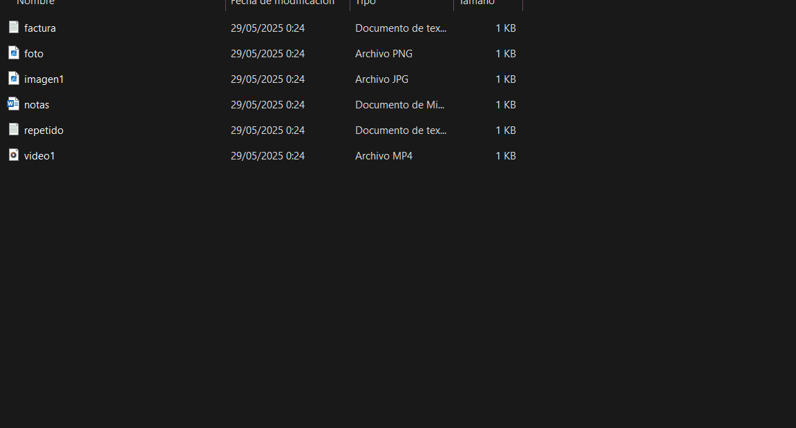

# Folder Cleaner CLI · Organizador automático de archivos

A Python script that organizes your files by type (documents, images, videos, others).  
Includes `--dry-run` mode, duplicate detection via SHA-256 hash, and support for public Google Drive folders.

Un script en Python que organiza tus archivos por tipo (documentos, imágenes, vídeos, otros).  
Incluye modo `--dry-run`, detección de duplicados por hash SHA-256 y soporte para carpetas públicas de Google Drive.


## Demo



---

##  What does it do? / ¿Qué hace?

- Automatically sorts files into folders: `/documents`, `/images`, `/videos`, `/others`
- Detects duplicate files based on content (not just name)
- Simulates changes without moving files (`--dry-run`)
- Downloads files from public Google Drive folders
- Generates a detailed log of all actions (for review or debugging)

- Ordena automáticamente los archivos en carpetas: `/documentos`, `/imágenes`, `/videos`, `/otros`
- Detecta archivos duplicados basándose en el contenido (no solo en el nombre)
- Simula los cambios sin mover archivos (`--dry-run`)
- Descarga archivos desde carpetas públicas de Google Drive
- Genera un registro detallado de todas las acciones (para revisión o depuración)

---

##  How to use / Cómo se usa

### 1. Install the required package / Instala la dependencia necesaria:

```bash
pip install gdown
```

### 2. Run the script / Ejecuta el script:

```bash
python folder_cleaner.py --carpeta ./downloads --dry-run
```

### 3. Optional: download from Drive / Opcional: descarga desde Drive:

```bash
python folder_cleaner.py --carpeta ./projects --drive-folder-url https://drive.google.com/drive/folders/YOUR_ID
```

---

##  Arguments / Parámetros

| Flag | Description / Descripción |
|------|----------------------------|
| `--carpeta` | Folder to organize / Carpeta que quieres organizar (**required / obligatorio**) |
| `--dry-run` | Simulate without moving files / Simula sin mover archivos |
| `--drive-folder-url` | Google Drive folder URL (public) / URL pública de carpeta Drive |

---

##  Folders created / Carpetas creadas

| Folder / Carpeta | Extensions / Extensiones |
|------------------|--------------------------|
| `documentos` / `documents` | `.pdf`, `.docx`, `.txt` |
| `imágenes` / `images` | `.jpg`, `.png`, `.jpeg` |
| `videos` / `videos` | `.mp4`, `.mov`, `.avi` |
| `otros` / `others` | All other extensions / Cualquier otra extensión |

---

##  Notes / Notas

- If a file with the same name already exists, the script creates a versioned copy: `file(1).pdf`
- Duplicate detection uses SHA-256 hashes
- A log is saved at `logs/mini_reto.log`

- Si un archivo con el mismo nombre ya existe, se crea una copia numerada: `archivo(1).pdf`
- La detección de duplicados usa hashes SHA-256
- Se guarda un registro en `logs/mini_reto.log`

---

##  Want to test it safely? / ¿Quieres probarlo sin riesgos?

Run it with `--dry-run` to see what would happen without making any changes.  
Ejecuta con `--dry-run` para ver qué pasaría sin mover ningún archivo.

---

##  License / Licencia

MIT License. Use it, modify it, improve it.  
Licencia MIT. Úsalo, modifícalo, mejoralo.

---

Created by @thegarciastudio
Creado por @thegarciastudio

